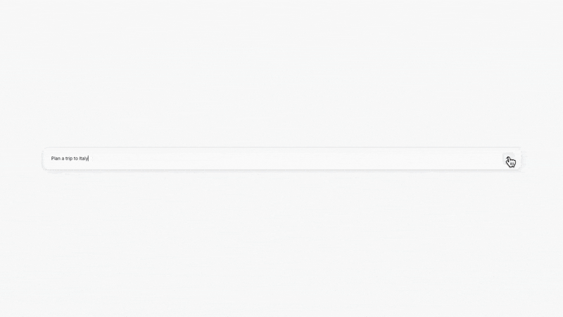

## Preview

## Introduction

Experience the future of visual collaboration and ideation through [Thesys](https://www.thesys.dev/), where large language models and generative UI converge to create intelligent, interactive canvases. From AI-generated planning cards and research summaries to dynamic visualizations and collaborative layouts, this demo showcases how generative UI transforms traditional canvas tools into an adaptive, context-aware workspace that understands and responds to your creative and analytical needs.

## Demo




[](https://thesys.dev)
[](https://canvas-with-c1.vercel.app/)

## Overview

This project reimagines what visual collaboration could be if combined with Thesys GenUI:

1. **Intelligent Canvas** - Interactive tldraw-powered canvas that serves as your creative workspace
2. **AI-Generated Cards** - Dynamic cards created on-the-fly based on your prompts using C1
3. **Context-Aware Responses** - Cards that understand the context of your existing canvas content
4. **Visual Collaboration** - Organize ideas, plans, and research in a flexible, visual format
5. **Resizable Components** - Each AI-generated card can be resized and repositioned on the canvas

Unlike traditional mind mapping tools or static planning software, this project creates intelligent, visually rich cards that adapt to your workflow and thinking process.

## Tech Stack

- **Frontend**: Next.js 15 with App Router
- **Canvas**: tldraw for infinite canvas experience
- **UI**: Tailwind CSS and Thesys GenUI SDK
- **AI Integration**: Thesys C1 SDK
- **Image Search**: Unsplash API for high-quality image sourcing
- **Streaming**: Real-time response streaming for live card generation
- **Hotkeys**: React Hotkeys Hook for keyboard shortcuts

## Getting Started

### Prerequisites

- Node.js (v20+)
- NPM or PNPM
- Thesys API key
- Unsplash API access key (get one at [unsplash.com/developers](https://unsplash.com/developers))

### Setup

1. Clone the repository:

   ```bash
   git clone https://github.com/thesysdev/canvas-with-c1.git
   cd canvas-with-c1
   ```

2. Install dependencies:

   ```bash
   npm i
   ```

3. Generate a new API key from [Thesys Console](https://chat.thesys.dev/console/keys) and set it as your environment variable:

   ```bash
   export THESYS_API_KEY=<your-api-key>
   export UNSPLASH_ACCESS_KEY=<your-unsplash-access-key>
   ```

   Or create a `.env.local` file:

   ```
   THESYS_API_KEY=your_thesys_api_key
   UNSPLASH_ACCESS_KEY=your_unsplash_access_key
   ```

### Development

Run the development server:

```bash
npm run dev
```

Open [http://localhost:3000](http://localhost:3000) in your browser.

## How It Works

1. User opens the infinite canvas workspace
2. User types a prompt using the prompt input (accessible via Cmd/Ctrl + K)
3. The application sends the prompt and canvas context to the Thesys C1 API
4. C1 generates appropriate cards based on the prompt and existing canvas content
5. Cards are rendered as resizable, interactive components on the canvas
6. Users can move, resize, and organize cards to build their ideas visually
7. Additional prompts can reference existing cards for contextual responses

## Key Features

- **Infinite Canvas**: Powered by tldraw for unlimited workspace
- **AI-Generated Cards**: Smart cards for ideation, planning, and research
- **Context Awareness**: New cards understand existing canvas content
- **Keyboard Shortcuts**: Quick access to prompt input (Cmd/Ctrl + K)
- **Responsive Design**: Cards adapt to different sizes and layouts
- **Real-time Streaming**: Watch cards generate in real-time
- **Visual Organization**: Drag, drop, and resize cards freely

## Customization

You can customize the AI behavior by modifying the system prompt in `src/app/api/ask/systemPrompt.ts`. The current system encourages:

- Short, focused cards
- Visually rich layouts
- Charts, images, and mini-components
- Tables for comparisons
- Contextual responses

## Contributing

Contributions are welcome! Please feel free to submit a Pull Request.

## License

This project is licensed under the MIT License - see the LICENSE file for details.

## Acknowledgments

- [Thesys](https://www.thesys.dev/) - Build GenUI Apps
- [C1 Documentation](https://docs.thesys.dev/welcome) - Learn how to use C1 and build AI apps
- [Example Apps](https://github.com/thesysdev/examples/tree/main) - Clone and explore more C1 example projects
- [tldraw](https://tldraw.dev/) for the incredible canvas library
- [Next.js](https://nextjs.org/) for the React framework
